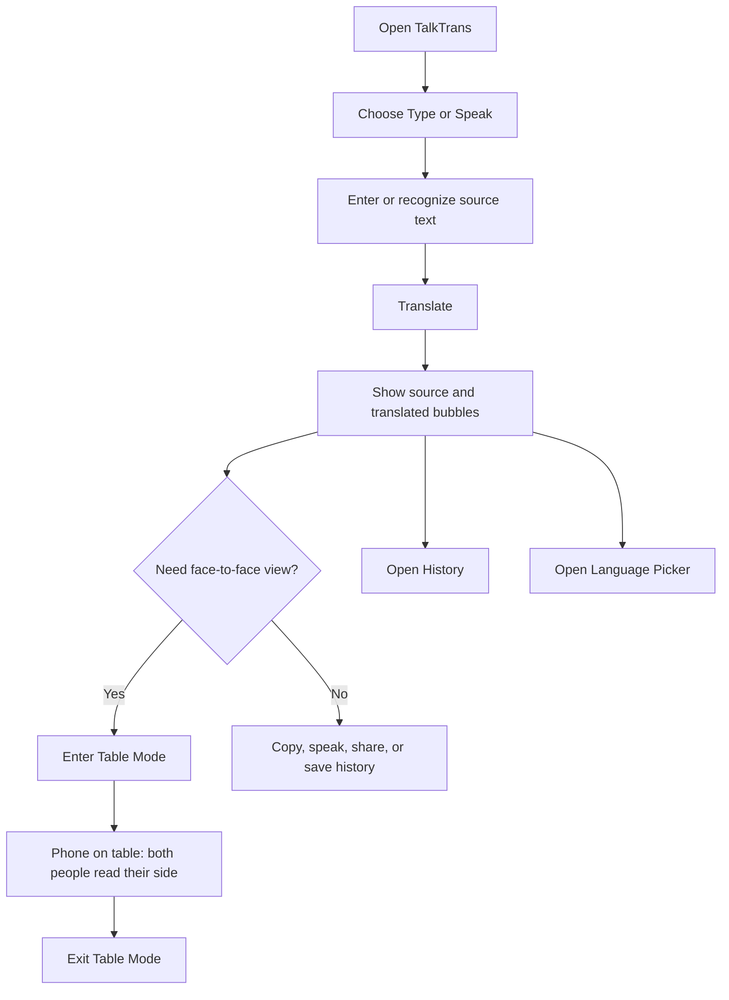

# TalkTrans Duo Design Application Spec

Source bundle: `design/`  
Primary design: `design/project/TalkTrans Duo.dc.html`  
Purpose: translate the exported Claude Design prototype into actionable SwiftUI implementation guidance for this repository.

## Goal

Apply the **Duo** visual direction to TalkTrans: a two-person translation interface where “you” and “them” are color-coded throughout the app, with a signature **Table Mode** for face-to-face reading.

Success criteria:
- Main translation UI clearly separates source/input and translated/output roles.
- “You” uses warm amber/orange; “Them” uses teal/mint.
- Table Mode splits the screen into two readable halves in portrait.
- Landscape mode prioritizes large translated output and keeps ads away from the translated message.
- Dark and light appearances share the same layout semantics and role colors.

## User flow

## Core visual direction

### Theme concept

“Duo — two people, two colors.”

- **You / source speaker**: amber/orange.
- **Them / translated reader**: teal/mint.
- The role color should appear in labels, borders, badges, gradients, and Table Mode panels.
- Avoid neutral-only cards for the core translation pair; color should make the speaker relationship immediately obvious.

### Color tokens

Use semantic SwiftUI tokens rather than hardcoding everywhere.

#### Dark mode

| Token | Value | Usage |
|---|---:|---|
| `appBackground` | `#0C0E14` | Main app background |
| `appSurface` | `#12151D` | Input card / lower-emphasis surfaces |
| `appElevatedSurface` | `#161A24` | Output card / toolbar buttons |
| `appDivider` | `rgba(255,255,255,0.06)` | Hairlines and card borders |
| `youAccent` | `#FFB443` | Source speaker, input, Korean example |
| `youAccentDeep` | `#FF7A59` | Voice gradient end |
| `themAccent` | `#34E0C4` | Target speaker, output, English example |
| `themAccentDeep` | `#22B8A6` | Primary teal gradient end |
| `textPrimary` | `#F2F4F8` | Main text |
| `textSecondary` | `#C5CAD6` | Body secondary |
| `textTertiary` | `#8A90A2` | Labels and inactive controls |
| `textMuted` | `#5A6072` | Metadata and icons |

#### Light mode

| Token | Value | Usage |
|---|---:|---|
| `appBackground` | `#EEF1F5` | Main app background |
| `appSurface` | `#FFFFFF` | Cards and controls |
| `appControlSurface` | `#E2E6EC` | Segmented background / secondary controls |
| `youAccent` | `#E58A00` | Source speaker |
| `youAccentDeep` | `#C67600` | Source labels |
| `themAccent` | `#0FB5A0` | Target speaker |
| `themAccentDeep` | `#0C9585` | Target labels |
| `textPrimary` | `#131720` | Main text |
| `textSecondary` | `#3E4453` | Body secondary |
| `textTertiary` | `#8A90A2` | Labels and inactive controls |
| `textMuted` | `#A3AAB6` | Metadata and placeholders |

## Screens and components

### 1. Main translation screen

Current mapping:
- `Projects/App/Sources/Screens/TranslationScreen.swift`
- `Projects/App/Sources/Views/TranslationInputView.swift`
- `Projects/App/Sources/Views/TranslationOutputView.swift`
- `Projects/App/Sources/Views/LanguagePickerButton.swift`
- `Projects/App/Sources/Managers/SwiftUIAdManager.swift`

Design requirements:
- Header: small TalkTrans wordmark, `Talk` in primary text and `Trans` in them-accent.
- Top actions: compact circular buttons for rotate/reset/settings-style controls where applicable.
- Mode selector: segmented control with `Type` and `Speak`.
- Output card appears above input card.
- Output card uses them-accent border and label: `EN · for them`.
- Input card uses you-accent border and label: `KO · you`.
- Character counter remains visible in the input card: `32 / 500`.
- Primary CTA remains a large bottom `Translate` button.
- Reward/ad-free button remains a square secondary CTA with gift styling.
- Suggested phrases appear as horizontal chips under input/output when useful.

Approximate sizing:
- Screen horizontal padding: 16pt.
- Card corner radius: 20pt.
- Card padding: 15pt.
- Bottom CTA height: 52pt.
- Secondary CTA size: 52pt square.
- Segment corner radius: 12pt outer / 9pt selected.

### 2. Voice input

Current mapping:
- `Projects/App/Sources/Screens/SpeechRecognitionScreen.swift`
- `Projects/App/Sources/ViewModels/SpeechRecognitionViewModel.swift`

Design requirements:
- Full-screen or sheet-like focused listening state.
- Speaker pill at top-left: `Speaking Korean`, using you-accent.
- Large centered circular mic control with concentric rings.
- Recognized text centered below mic.
- Bottom actions:
  - `Cancel` secondary.
  - `Use & translate` primary with them-accent gradient.

Approximate sizing:
- Mic orbit: 172pt.
- Mic button: 92pt.
- Bottom buttons: 50pt high, 15pt corner radius.

### 3. Table Mode

This is the signature interaction from the design.

Target mapping:
- Add a SwiftUI `TableModeScreen` or `TableModeView` under `Projects/App/Sources/Screens/` or `Views/`.
- Trigger from `TranslationScreen` near the seam between output and input, or from a dedicated table-mode CTA.

Portrait behavior:
- Screen splits vertically into two equal 50% panels.
- Top half is for “them” and rotated 180° so it faces the person across the table.
- Bottom half is for “you” and remains upright.
- Center seam has a circular swap/duo indicator.
- Top panel uses them-accent gradient.
- Bottom panel uses you-accent gradient.
- Include an `Exit` pill/button on the user-facing side.
- Include `Speak to reply` CTA on the user-facing side if speech is available.

Landscape behavior:
- Table Mode becomes **output-only**.
- Hide input controls and ads.
- Show a single large translated message, upright for the target reader.
- Show small label: `TABLE MODE · OUTPUT ONLY`.
- Provide a clear exit button.

Important ad rule:
- **Never show banner ads inside Table Mode.**
- In normal landscape, the banner is anchored to the bottom edge, not between source and translated content.

### 4. Language picker

Current mapping:
- `Projects/App/Sources/Screens/LanguageSelectionScreen.swift`
- `Projects/App/Sources/Models/TranslationLocale.swift`
- `Projects/App/Sources/Models/TranslationLocale+Extension.swift`

Design requirements:
- Title: `Languages`.
- Top summary card with two columns:
  - `YOU` + current source language.
  - `THEM` + current target language.
  - Swap icon between them.
- Search field placeholder: `Search 13 languages`.
- Section label should describe selected side, e.g. `Their language`.
- Selected language row uses them-accent highlight when selecting target, you-accent when selecting source.
- Rows include flag, English display name, native display name, and checkmark for selected.

### 5. History

Current mapping:
- `Projects/App/Sources/Screens/HistoryScreen.swift`
- `Projects/App/Sources/Views/HistoryRow.swift`
- `Projects/App/Sources/Views/HistoryDetailSheet.swift`

Design requirements:
- Title: `History`.
- Optional `Clear` action appears as accent text if destructive flow exists.
- Grouping label example: `Today · Seoul`.
- History cards use rounded surfaces with a 2pt role-colored leading bar.
- Main translated text is primary and source text is secondary.
- Metadata row: language direction and timestamp.
- Favorites can use the existing favorited filter but should inherit the Duo card language.

## Landscape and ad placement

The design explicitly changes ad placement:

- Current/problem: banner between input and output splits the conversation.
- Desired: banner anchored to the bottom of normal translation screens.
- Desired in landscape: two language cards side by side; banner spans bottom full width.
- Desired in Table Mode: no banner at all.

Implementation notes:
- Make ad placement depend on presentation mode:
  - `normalPortrait`: bottom area below Translate if space allows, or below content stack.
  - `normalLandscape`: full-width bottom anchor.
  - `tableMode`: hidden.
- Keep translation pair visually adjacent; do not insert ads between source and translated cards.

## Implementation milestones

### Phase 1 — Design tokens and card polish

Owner: iOS developer

Deliverables:
- Add semantic color/style helpers for Duo role colors.
- Update input/output cards to use Duo role labels, borders, and surfaces.
- Keep existing translation behavior unchanged.

Verification:
- Build succeeds with `mise x -- tuist build`.
- Manual check: translate text and verify source/target colors remain consistent after language swap.

### Phase 2 — Ad placement and landscape layout

Owner: iOS developer + QA

Deliverables:
- Move banner away from the source/output seam.
- Add landscape side-by-side layout if not already present.
- Ensure banner is bottom anchored in landscape.

Verification:
- Manual check portrait and landscape on iPhone simulator.
- Confirm banner does not obscure Translate, input, or output.

### Phase 3 — Table Mode MVP

Owner: iOS developer

Deliverables:
- New Table Mode view.
- Entry/exit from TranslationScreen.
- Portrait split view and landscape output-only view.
- No ads in Table Mode.

Verification:
- Manual check portrait: top text rotated for the other person, bottom text upright.
- Manual check landscape: large output-only message, no input, no ad.
- Verify accessibility labels for entry/exit and speak-to-reply controls.

### Phase 4 — Voice, language picker, and history polish

Owner: iOS developer + QA

Deliverables:
- Apply Duo visual language to speech recognition, language selection, and history.
- Preserve existing persistence, history re-translate, and favorites behavior.

Verification:
- Speech recognition opens, cancels, and applies recognized text correctly.
- Language selection persists.
- History list, detail, favorite, share, and re-translate still work.

## Risks and mitigations

- Risk: Table Mode rotation conflicts with existing full-screen/orientation behavior.
  - Mitigation: isolate Table Mode in its own view state and keep current `isFullScreen` behavior unchanged until Phase 3.
- Risk: ad placement changes reduce revenue or break existing reward logic.
  - Mitigation: preserve reward state and only change placement/visibility by mode.
- Risk: redesign scope grows into a full navigation rewrite.
  - Mitigation: keep existing MVVM and screen files; only introduce new reusable views where needed.
- Risk: dark/light token mismatch with current assets.
  - Mitigation: implement semantic tokens first and test in both appearances before broad rollout.

## Definition of done

- UI matches the Duo direction across the main translation flow.
- Table Mode exists and never displays ads.
- Normal landscape keeps ads bottom-anchored.
- Existing translation, speech, history, language persistence, and review/ad-free behavior still work.
- Build and test pass through Tuist/CI.
